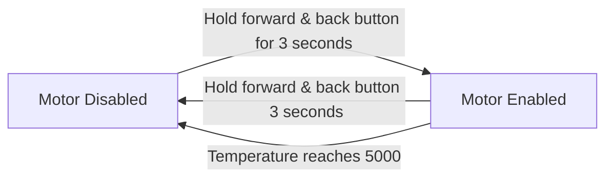

# Drive component
A drive component simulator. Built in C in Windows.
## Controls:
w - Toggle forward button pressed

e - Toggle backward button pressed

Up arrow - Move joystick forward

Down arrow - Move joystick backward

Left arrow - Decrease temperature input

Right arrow - Increase temperature input

q - Quit

## Disabling and enabling the motor

## Motor Throttle value
Throttle value < -100
y = 10/9 x + 1000/9

Throttle value > 100
y = 10/9 x - 1000/9

else, 0

## Configuration file

The configuration file is the file drive.conf. This file must be located in the same directory as the built executable. It must contain integer values of the following properties in the correct order:

Hold to start time (ms)
Hold zone threshold for joystick
Hold to cruise time (ms)
Max temperature
Min temperature

